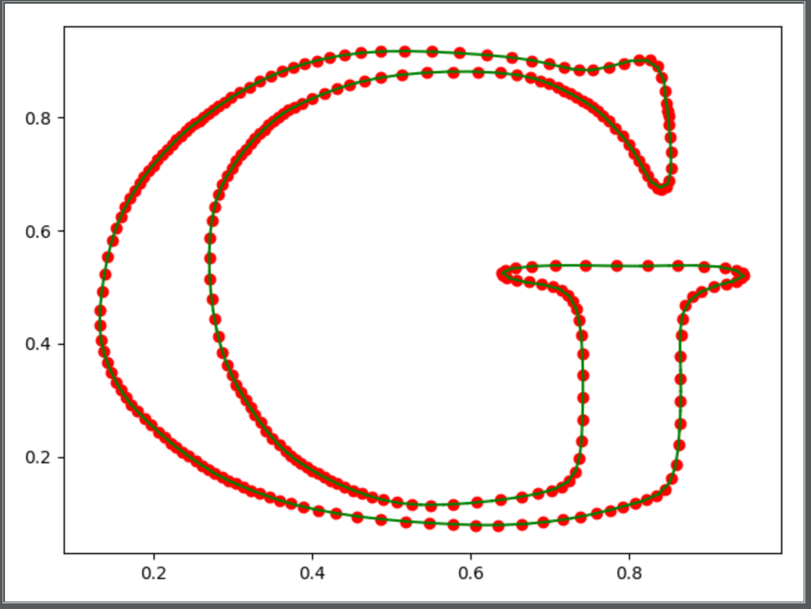
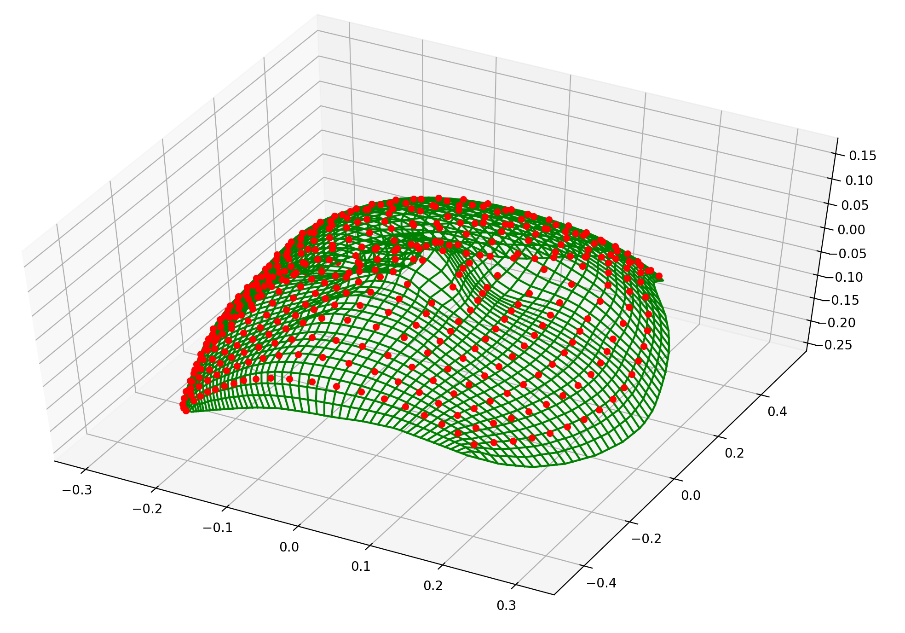

# LSPIA
对LSPIA方法对实现。

该方法详细论述请看论文《Progressive and iterative approximation for least squares B-spline curve and surface fitting》.

## 注意事项
1. 使用LSPIA拟合曲面及曲线时，需要数据点数量足够大。在初始测试时，我使用10个点拟合曲线，无法得到理想效果；使用20x20个点拟合曲面，误差十分大；
2. 关于曲面拟合，论文中没有给出miu的定义，miu影响曲面拟合的速度，可自行根据数据进行调整；
3. 初始点选择，对于初始点定义，可以按照文章中的方式间隔采样取点，也可以随机取点。我在测试时将所有数据点设为相同，仍能得到理想结果。初始点的定义只影响迭代的次数。

## 实验结果
- **LSIPIA拟合曲面**

- **LSPIA拟合曲面**

